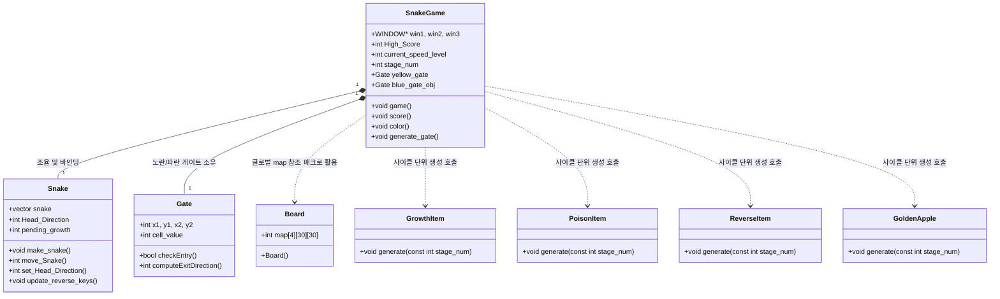

# 🐍 C++ ncurses Snake Game (C++ 스네이크 게임)

> **ncurses 라이브러리를 활용하여 객체 지향 프로그래밍(OOP) 패러다임으로 정교하게 설계된 C++ 터미널 기반 스네이크 게임입니다.**
>
> 본 프로젝트는 게임의 핵심 기능(맵 데이터, 뱀 객체, 4종의 전략적 아이템, 2종의 물리 게이트, 점수/미션 시스템)을 독립된 클래스로 캡슐화하여 결합도를 낮추고 모듈성을 극대화한 탄탄한 아키텍처를 자랑합니다.

---

## 🎬 시현 화면
터미널 환경에서 가상 GUI 레이아웃을 통해 메인 맵 게임 창, 실시간 미션 현황판, 점수 및 영속적 최고 기록판을 나누어 제공합니다.

---

## 🛠️ 빌드 및 실행 방법 (How to Build and Run)

이 프로젝트는 C++11 표준과 `ncurses` 라이브러리를 사용하여 개발되었습니다. 리눅스/WSL 환경에서 아래 단계에 따라 빌드 및 실행하실 수 있습니다.

### 1. 필수 라이브러리 설치 (ncurses)
터미널 화면 제어 및 키 입력 감지를 위해 `ncurses` 라이브러리를 설치해야 합니다.
```bash
sudo apt-get update
sudo apt-get install libncurses5-dev libncursesw5-dev
```

### 2. 컴파일 (Compile)
Makefile이 포함되어 있으므로 `make` 명령어로 간단하게 빌드할 수 있습니다.
```bash
# 기존 빌드 결과물 삭제 및 청소
make clean

# 프로젝트 전체 컴파일 및 빌드
make
```

### 3. 게임 실행 (Run)
컴파일이 완료되면 생성되는 `snakegame` 바이너리 실행 파일을 구동합니다.
```bash
./snakegame
```
*⚠️ **주의사항:** 터미널 화면에 GUI 레이아웃을 직접 렌더링하므로, 원활한 플레이를 위해 실행 전 터미널 창의 크기를 충분히 키운 상태에서 실행해 주세요.*

---

## 🎮 게임 규칙 및 시스템 상세 (Game Features)

### 🧱 [1단계] MAP 구성
*   **맵 크기 및 구조:** 30x30 크기의 총 4개 스테이지별 고유 맵 디자인 제공.
*   **벽 요소의 분리:**
    *   `Wall (셀 값 1, 회색)`: 게이트(Gate) 입출구로 변경될 수 있는 일반 벽.
    *   `Immune Wall (셀 값 2, 검은색)`: 절대로 게이트가 생성되지 않는 고정 면역 벽.

### 🐍 [2단계] Snake 조작 및 동적 난이도
*   **표현:** 뱀의 머리(`셀 값 3, Cyan`)와 몸통(`셀 값 4, Blue`)을 시각적으로 구분하여 렌더링.
*   **기본 조작:** 방향키(`Arrow Keys`)를 통해 뱀의 진행 방향 제어.
*   **게임 오버:** 벽 또는 자신의 몸통에 충돌하거나 진행 방향의 반대 방향 키를 입력하여 180도 즉시 회전을 시도할 경우 게임 오버.
*   **동적 속도 난이도:** 스테이지가 상승할수록 프레임 대기 시간을 단계적으로 감축시켜 뱀의 전진 속도가 빨라짐 (SPEED 레벨 1~4 실시간 반영).

### 🍎 [3단계] 전략적 4종 아이템 (Items)
매 사이클(15초)마다 맵 상의 빈칸에 거부 표본추출(Rejection Sampling) 방식으로 겹침 없이 자동 재배치됩니다.
1.  **Growth Item (셀 값 5, 녹색):** 획득 시 뱀의 몸통 길이 +1 증가.
2.  **Poison Item (셀 값 6, 적색):** 획득 시 뱀의 몸통 길이 -1 감소. (길이가 3 미만이 되면 게임 오버)
3.  **Reverse Direction Item (셀 값 8, 마젠타):** 획득 시 10초 동안 진행방향의 수직인 두 화살표 키 기능이 서로 반대로 바뀜. (3 스테이지 이상부터만 출현)
4.  **Golden Apple (셀 값 9, 금색):** 사이클당 1/10 확률로 희귀하게 등장. 획득 시 뱀의 길이가 +3 증가하며, 시각적 자연스러움을 위해 3틱에 걸쳐 꼬리 자르기를 생략하는 분산 성장 알고리즘(`pending_growth`) 적용.

### 🌀 [4단계] 물리 게이트 (2종 Gates)
일반 벽(1) 중 서로 겹치지 않게 무작위 좌표에 한 쌍씩 배치됩니다.
1.  **Yellow Gate (셀 값 7, 노란색):** 한쪽 진입 시 짝이 되는 게이트로 텔레포트 이동.
2.  **Blue Gate (셀 값 11, 파란색):** 텔레포트 기능 수행과 동시에 몸통 길이 +1 보너스 부여.
*   **진출 방향 결정 알고리즘 (명세 규칙 #4 준수):**
    *   진출 게이트가 맵 가장자리에 있는 경우: 무조건 맵 안쪽 방향으로 진출.
    *   진출 게이트가 맵 가운데에 있는 경우: (진입 방향 유지) → (세로/가로 개방 여부와 진입 방향에 따른 우선순위 방향) → (역방향) 순서의 단계적 우선순위 적용.

### 📊 [5단계] 점수, 미션 및 이스터에그 (Score, Mission & Easter Egg)
*   **실시간 점수 및 미션 시스템:**
    *   **B (Body):** 현재 뱀의 길이 / 스테이지 내 최대 뱀 길이 표시 및 미션 대조.
    *   **+ (Growth):** 획득한 성장 아이템 수 집계.
    *   **- (Poison):** 획득한 독 아이템 수 집계.
    *   **G (Gate):** 게이트 통과 횟수 집계.
    *   **TIME / SPEED:** 스테이지 경과 시간 및 현재 난이도 속도 단계 출력.
*   **최고 기록 영속성 관리:** 최고 점수 경신 시 실시간 파일 입출력(`highscore.txt`)을 제어하여 저장 및 로드.
*   **🌟 이스터에그 - Untouched Path:** 뱀이 이동했던 경로(`visited[30][30]`)를 전역적으로 추적하여, 단 한 번도 경로가 겹치지 않고 이동하여 미션을 올 클리어했을 시 스테이지 클리어 연출 화면에 히든 캐릭터 문구(`★ EASTER EGG ★ UNTOUCHED PATH!`)를 출력하는 독창적 요소 탑재.

---

## 🏛️ 소프트웨어 설계 및 클래스 구조

프로젝트의 결합도를 완벽히 제거하기 위해 MVC 패턴에 준하게 기능이 완전 모듈화되어 있습니다.



---

## 👥 팀원 및 역할 (Team Contributions)

| 이름 | 역할 및 담당 기능 |
| :---: | :--- |
| **심한솔 (팀장)** | **• 1단계 MAP 구현:** `Board` 클래스 객체화, 3D 맵 데이터 구조 설계, 소스 코드 간 하위 호환성 매크로 구축<br>**• 5단계 SCORE 및 이스터에그 구현:** NCURSES 레이아웃 분할, 실시간 목표 판정, `highscore.txt` 최고 기록 파일 입출력 제어, 중복 경로 검증 이스터에그 시스템 구현 |
| **이준원** | **• 2단계 SNAKE 구현:** `Snake` 클래스 모듈 분리, 뱀의 생성/조작/기본 이동 처리, 역방향 충돌 및 게임오버 물리 판정, 스테이지 틱 지연 속도 조절 |
| **채우리** | **• 3단계 ITEM 구현:** 4종 아이템(`Growth`, `Poison`, `Reverse`, `Golden Apple`) 클래스 분리 설계, 거부 표본추출 알고리즘, Golden Apple 누적 분산 성장 및 Reverse Item 실시간 키 변경 엔진 구현 |
| **김유탁** | **• 4단계 GATE 구현:** `Gate` 클래스 설계, 거부 표본추출 벽 배치 알고리즘, [명세 규칙 #4] 기반 입출 진출 방향 검증 알고리즘 설계 및 파란 게이트 버그 정밀 패치 |
